# ML-Scaler

A comprehensive ML deployment management system for Kubernetes-based machine learning model scaling and orchestration. ML-Scaler provides automated deployment, scaling, and lifecycle management for ML models on Azure Kubernetes Service (AKS) with Databricks integration.

## Features

- **Automated ML Model Deployment** - Deploy ML models to Kubernetes with automated configuration
- **Dynamic Scaling** - Auto-scale model deployments based on demand
- **Deployment Management** - List, update, and delete model deployments via CLI
- **Database Persistence** - Track deployment specs, compute instances, storage, and event sources
- **Databricks Integration** - Connect and manage Databricks workspaces for ML workflows
- **Azure DevOps Integration** - Trigger CI/CD pipelines for model deployments
- **CLI Interface** - Typer-based command-line tool for operations

## Prerequisites

- Python 3.10 or higher
- Docker and Docker Compose
- PostgreSQL database
- Databricks workspace and access token
- Azure Kubernetes Service (AKS) cluster
- Azure DevOps account (for pipeline integration)
- Azure Service Principal credentials

## Quick Start Guide

### Installation

#### Using Docker Compose (Recommended)

Using a Docker Compose file along with a local environment file and configuration YAML values will bring the CLI wrapper up and running.

```bash
# Clone the repository
git clone <repository-url>
cd <directory>

# Start services
docker-compose up -d
```

#### Local Installation

```bash
# Install dependencies
pip install -e .

# Set up environment variables (see Configuration)
cp env.example .env
# Edit .env with your configuration
```

### Configuration

#### Security Setup

**IMPORTANT**: Never commit credentials to version control. Use environment variables for all sensitive data.

1. Create a `.env` file from the example:
   ```bash
   cp .env.example .env
   ```

2. Configure required environment variables in `.env`:
   - **Database**: `DATABASE_URL`
   - **Azure DevOps**: `AZURE_DEVOPS_PAT`
   - **Azure Service Principal**: `TENANT_ID`, `CLIENT_ID`, `CLIENT_SECRET`
   - **Azure Databricks Configurations**: `DATABRICKS_HOST`, `DATABRICKS_TOKEN`

3. Update `app/config.yaml` with non-sensitive configuration:
   - Azure DevOps organization, project, pipeline, and branch name
   - AKS api_server & namespace 
   - You can also handle the logging_level, db_config non-sensitive informations accordingly.  

## NOTE:----> You can set the configurations either in ".env" file or  "app/config.yaml" accordingly based on sensitivity.

4. **For Production**: Use Azure Key Vault or similar secret management service instead of `.env` files


### CLI Interface

```bash

#To see functionalities available

mlscaler --help


      [ABOVE COMMAND WILL GUIDE YOU HOW TO USE DEFINED CLI COMMANDS] 

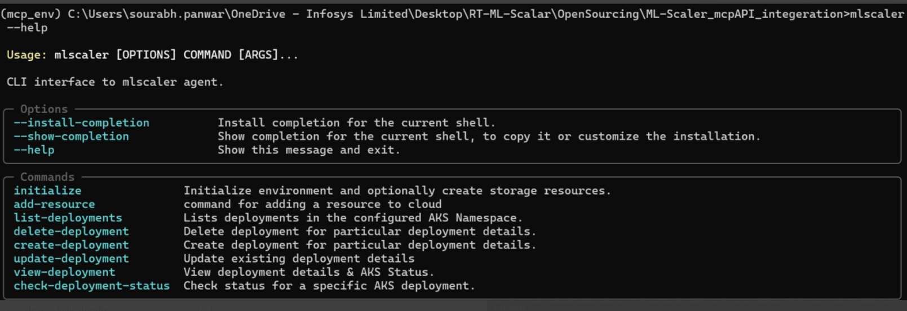

#CLI commands offered by mlscaler

#### `initialize`
Initialize environment, check DB health, and ensure required tables are present.

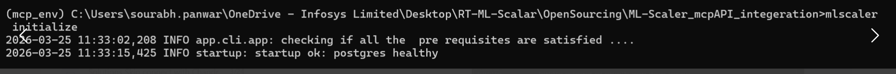

#### `add-resource`
Add configuration for required instance resources (storage, compute, event source, deployment spec) to DB.

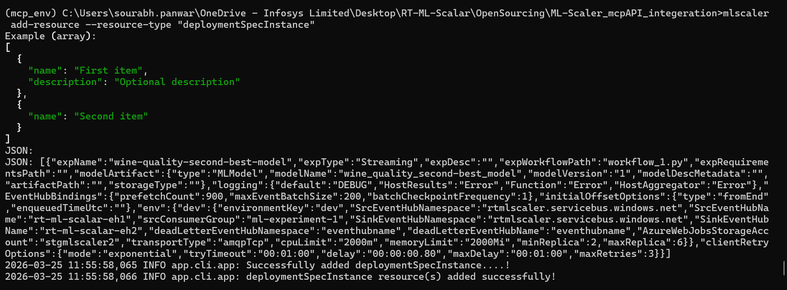

#### `create-deployment --deployment-name <name>`
Trigger deployment for a specific deployment name. Checks AKS for existing deployment first. Use `--overwrite-deployment` flag if deployment already exists.
It has provision to check the pipeline status as well.

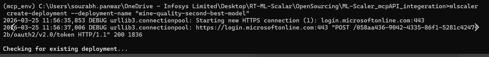
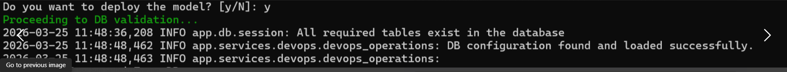
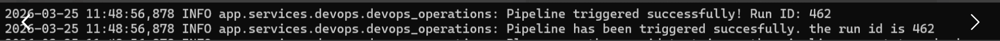

#### `update-deployment --deployment-name <name>`
Update configuration key-values for a deployment in DB. On user confirmation, triggers pipeline with updated configurations.
On trigger, it has provision to check the pipeline status as well.

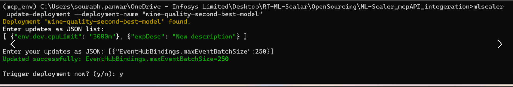

#### `view-deployment --deployment-name <name>`
View DB configurations and AKS deployment details for a specific deployment.

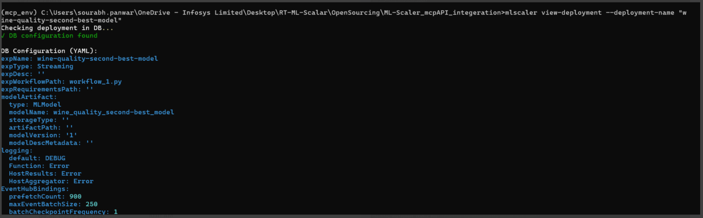
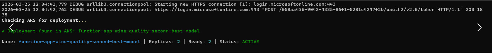

#### `list-deployments`
List all deployments available in AKS under the configured namespace.

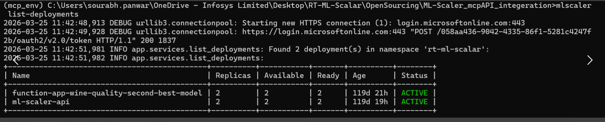

#### `check-deployment-status --deployment-name <name>`
Check deployment status in AKS for a specific deployment.

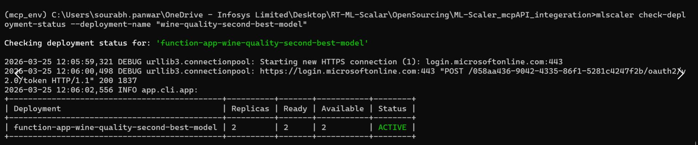

#### `delete-deployment --deployment-name <name>`
Delete deployment from AKS and DB configuration on user confirmation.

```

## Architecture

- **SQLAlchemy** - ORM for database operations
- **PostgreSQL** - Relational database for persistence
- **Typer** - Modern CLI framework
- **Kubernetes Client** - AKS cluster interaction
- **Azure DevOps API** - CI/CD pipeline orchestration

## Code Quality

This project follows Python best practices and PEP 8 guidelines. Future versions may include automated testing.

## Subscription-Based Offerings

ML-Scaler functionalities are also available through subscription-based platforms:
- **ChatBot Integration** - Access ML-Scaler features through an intelligent conversational interface

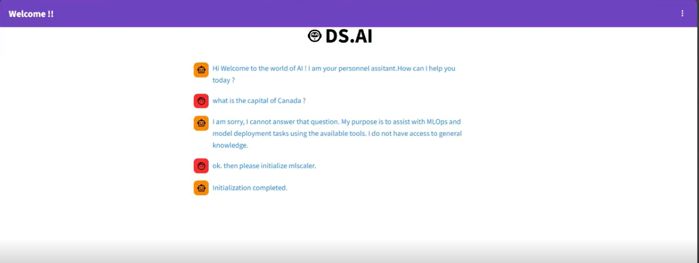


- **de.ai Platform by Infosys** - Enterprise-grade implementation of ML-Scaler with enhanced features and support

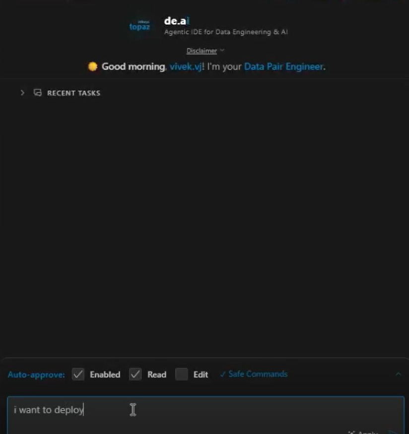
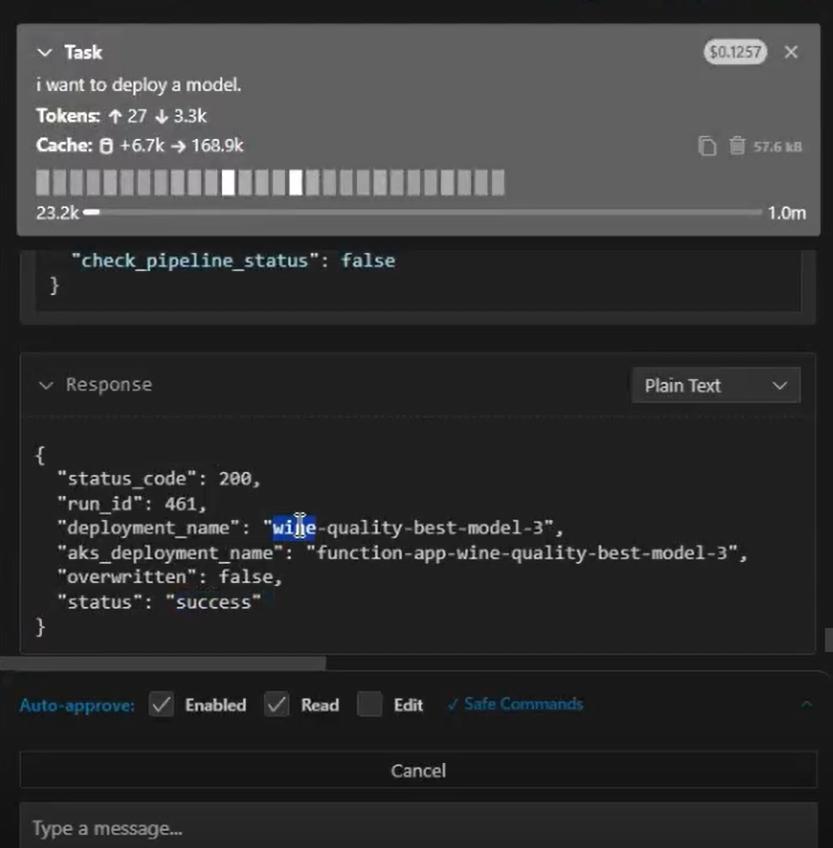

For subscription details and platform access, please contact our team.

## Contributing

Contributions are welcome! Please ensure:
- Code follows project style guidelines
- Documentation is updated as needed

## License

This project is licensed under the MIT License - see the [LICENSE](LICENSE) file for details.

## Support

For issues, questions, or contributions, please open an issue in the repository.
